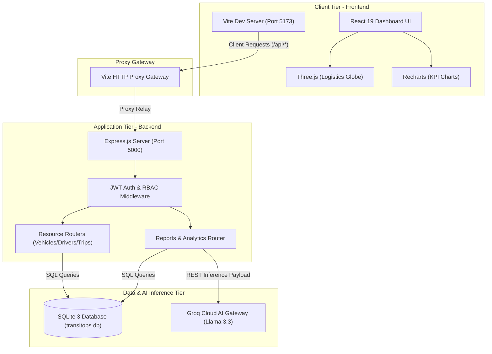

<div align="center">


# TransitOps
### Real-Time Smart Fleet Logistics & AI Operations Management Console

[](https://react.dev)
[](https://vitejs.dev)
[](https://console.groq.com/)
[](https://www.sqlite.org/)
[](https://threejs.org/)
[](LICENSE)

**Next-generation transport operations dashboard with dynamic telemetry, dispatches, and AI-powered optimizations.**  
Real-time dispatch tracking · Multi-role simulator matrix · Dynamic maintenance diagnostics · Groq LLaMA 3.3 Engine

Built for the Oodo Hackathon by Team **Vyomex**

</div>

---

## 🏗️ System Architecture



---

## 💡 The Problem

Modern logistics and supply chain networks struggle to coordinate vehicles, drivers, dispatches, and maintenance tasks efficiently. Fragmented tracking data leads to high fuel consumption, unoptimized maintenance checks, low fleet utilization, and high carbon footprints. TransitOps resolves this by aggregating telemetry data inside a unified hub powered by **Groq LLaMA 3.3 AI**, producing actionable executive optimizations in real-time.

### 🎯 Industry Alignment & Hackathon Focus
TransitOps aligns directly with **Logistics**, **Fintech**, and **Green Tech / ESG Compliance** domains:
*   **Green Logistics (ESG)**: Automatically computes carbon emissions footprint values for every vehicle based on actual fuel consumption.
*   **Preventative Logistics**: Prevents breakdown delays by calculating dynamic maintenance target dates.
*   **Security & Simulation**: Provides a simulated Role-Based Access Control matrix to test security layers across Fleet Managers, Dispatchers, and Financial Analysts.

---

## ✨ Features

| Module | What it does |
|--------|-------------|
| 🤖 **AI Copilot Fleet Analyst** | Ingests fleet SQL telemetry metrics, dispatch histories, and fuel records to query Groq's LLaMA 3.3-70B model, returning structured executive logistics optimizations. |
| 🗺️ **Interactive Dispatch Tracking** | Renders dynamic facility node coordinates and features an animated vehicle indicator that moves along active routes in real-time. |
| ⚙️ **Dynamic Maintenance Calculator** | Evaluates mileage left to the next `10,000 km` interval threshold, estimating calendar due dates and outputting color status alerts. |
| 🔐 **RBAC Simulator Matrix** | Allows evaluators to switch roles (Fleet Manager, Dispatcher, Safety Officer, Financial Analyst) dynamically with table glow accents highlighting active roles. |
| 📊 **High-Fidelity Operations Panel** | Visualizes expense breakdowns, top costliest vehicles, and monthly costs vs. revenues using Recharts React SVG panels. |
| 🌍 **Interactive Three.js Globe** | Features an interactive 3D logistics globe on the login panel rendering coordinates, glow meshes, and network transits. |

---

## 🗄️ Database & Telemetry Schema

TransitOps tracks metrics using a unified relational SQLite schema, consolidated into the following JSON format for the AI Inference engine:

```json
{
  "kpis": {
    "activeVehicles": 2,
    "availableVehicles": 8,
    "maintenanceVehicles": 3,
    "activeTrips": 2,
    "pendingTrips": 1,
    "driversOnDuty": 4,
    "fleetUtilization": 20,
    "totalCarbonEmissions": 3280.5
  },
  "vehicles": [
    {
      "registration_number": "GJ01AB452",
      "name_model": "VAN-05 (Tata Ace)",
      "type": "Van",
      "status": "Available",
      "acquisition_cost": 320000,
      "total_revenue": 145000,
      "total_distance": 4500,
      "total_fuel_liters": 450,
      "fuel_cost": 42000,
      "maintenance_cost": 8500,
      "operational_cost": 50500,
      "fuel_efficiency": 10.0,
      "roi": 27.03,
      "carbon_emissions": 1206.0
    }
  ]
}
```

---

## 🚀 Running Locally

### 1. Clone the repository
```bash
git clone https://github.com/ThePhantom-S/odoo-hackathon-Vyomex.git
cd odoo-hackathon-Vyomex
```

### 2. Install dependencies
Install concurrently at the root:
```bash
npm install
```
Then install the backend modules:
```bash
cd backend
npm install
cd ..
```

### 3. Set up environment variables
Create a `.env` file in the root directory:
```env
GROQ_API_KEY=your_groq_api_key_here
PORT=5000
JWT_SECRET=transitops_super_secret_key_123
```

### 4. Run the development server
Start the Express API and Vite React server concurrently:
```bash
npm run dev
```
* **Frontend console**: `http://localhost:5173`
* **Backend API server**: `http://localhost:5000`

### 5. Production build
Verify production readiness and compile the static bundle:
```bash
npm run build
```

---

## 👥 Team Vyomex

Built with ❤️ for the Oodo Hackathon by:
*   **Hari Krishnan R**
*   **Immanuel Thomas J**
*   **Jackson JP**
*   **Jenish S**

---

## 📄 License

Distributed under the MIT License.
