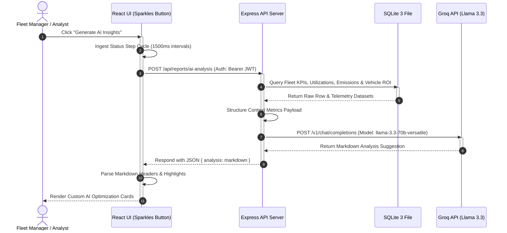

# 🚛 TransitOps: Smart Transport & Fleet Operations Platform

TransitOps is a high-fidelity, next-generation fleet logistics dashboard designed for the **Oodo Hackathon**. It integrates real-time SQLite database tracking, dynamic cargo dispatch, preventative maintenance intervals, role-based access control simulations, and **Groq AI-powered operations optimization**.

---

## 🚀 Key Features

### 🤖 AI Copilot Operations Analyst
* **Groq Llama-3.3 Integration**: Processes live SQLite telemetry database logs, vehicle ROI indicators, and emissions metrics.
* **Structured Executive Insights**: Generates ultra-concise highlights, risk assessments, and action items, eliminating long paragraphs.
* **Interactive Loading Pipeline**: Cycles through active computation steps in the UI (*Ingesting database schemas*, *Parsing maintenance logs*, *Querying Groq inference engine*) to create an immersive experience.

### 🗺️ Live Dispatch Route Tracking
* **Dynamic Node Topology**: Renders map facility coordinates and labels automatically derived from facility names.
* **Animated Telemetry**: An animated SVG vehicle indicator moves along active routes with custom telemetry dashboard panels.
* **Header Enhancements**: Displays facility names bolded on top with address details styled underneath.

### ⚙️ Dynamic Preventative Maintenance Indicator
* **Interval Calculations**: Targets service cycles based on multiples of the next `10,000 km` threshold, replacing static mileage limits.
* **Est. Date Calculation**: Estimates target calendar due dates dynamically based on average travel speed and current date.
* **Alert Classifications**: Applies multi-tier styling (Critical Red for `<1,500 km`, Warning Amber for `<3,500 km`, and Safe Green) to progress bars.

### 🔐 Simulated Role-Based Access Controls (RBAC)
* **Simulator Bar**: Interactively switch simulated evaluator roles (Fleet Manager, Dispatcher, Safety Officer, Financial Analyst) to test UI and route restrictions.
* **Matrix Highlighting**: Displays a styled glowing backdrop and a label next to the active role in the permissions table matrix.

### 🔔 System Compliance alerts popover
* **Alert Indicators**: A breathing warning glow animation triggers on the notification bell if there are active compliance alerts.
* **Severity Icons**: Displays custom Lucide status icons (Danger, Warning, Info) and color tints corresponding to alert severities.
* **Telemetry Heartbeat**: Includes a status monitor bar with a pulsing telemetry dot.

---

## 🏗️ System Architecture & Workflow

### 1. System Architecture Diagram
The architecture is structured as a decoupled client-server model with Vite acting as a local HTTP reverse-proxy, delegating authenticated queries to our Node.js SQLite server:


### 2. AI Executive Analysis Pipeline Workflow
Below is the sequence flow of the AI telemetry operations analysis, showing the lifecycle from the UI request trigger to the Groq inference return:



---

## 🛠️ Technology Stack

* **Frontend**: React 19, Vite, Vanilla CSS 3 (Theme variables & custom animations), Recharts (KPIs & trends), Three.js (Logistics Globe), Lucide React (Icons).
* **Backend**: Node.js, Express, SQLite 3 (Database storage), JWT & bcryptjs (Security), Dotenv (Env loading).

---

## ⚙️ Installation & Setup

### 1. Prerequisites
Ensure you have Node.js (version 18 or newer) installed.

### 2. Environment Configuration
Create a `.env` file in the root directory and add the following keys:
```env
GROQ_API_KEY=your_groq_api_key_here
PORT=5000
JWT_SECRET=transitops_super_secret_key_123
```

### 3. Install Dependencies
Run the following command at the root to install concurrent packages:
```bash
npm install
```
Then navigate to the backend directory and install backend packages:
```bash
cd backend
npm install
cd ..
```

### 4. Running the Application
Launch both the Express API and the Vite React server concurrently:
```bash
npm run dev
```
* **Frontend Local Server**: http://localhost:5173/
* **Backend API Server**: http://localhost:5000/

### 5. Production Build
Verify that the React client bundle compiles cleanly for deployment:
```bash
npm run build
```
